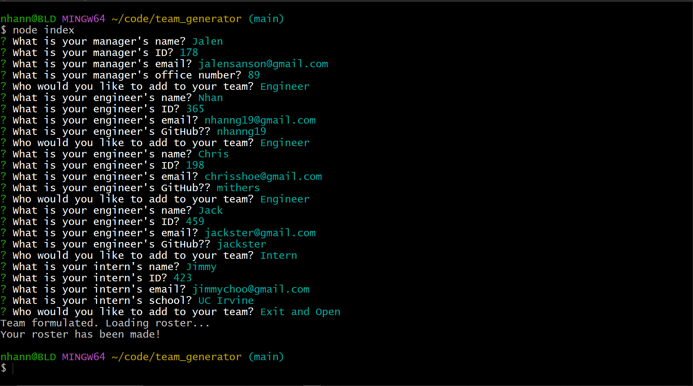

# Team Generator

We can test the application by invoking the following command: 
```bash
npm test
```

The application will be invoked by using the following command:

```bash
node index.js
```




[LINK TO THE VIDEO](https://drive.google.com/file/d/1Ci7bxKG6iobPDpliKT8-6gBYTkCGsD5i/view)

## The Process
- Install inquirer package
- Create index javascript file prompting input for users
- Create generateHTML javascript file writing data to generated HTML file
- Create class for each team member
- Create test for each class
- Stylize with bootstrap

Specific functions of index.js:

Order of operation when running node index
```javascript
managerStart()
.then((answers)=>{
  const manager = new Manager(answers.name, answers.id, answers.email, answers.officeNumber);
  team.splice(team.length-1, 0, manager.getHTML());
  teamProfile();
});
```

Retrieve and push data to generate HTML roster
```javascript
function printHTML(team){
  fs.writeFile("team.html", team.toString(), (err) => {
    if(err) {
      throw err;
    };
    console.log("Team formulated. Loading roster...");
  });
  setTimeout(() => {
  open("Team.html");
   console.log("Your roster has been made!");
  }, "1500")
  };
```

Specific functions of generateHTML.js

```javascript
const compHeader = function () {
    return `header of team roster with cdn links`
};

const compManager = function (data) {
    return `manager card with ${data.name}, ${data.id}, mailable ${data.email}, and ${data.officeNumber}`
};

const compEngineer = function (data) {
    return `engineer card with ${data.name}, ${data.id}, mailable ${data.email}, and openable ${data.github}`
};

const compIntern = function (data) {
    return `intern card with ${data.name}, ${data.id}, mailable ${data.email}, and ${data.school}`
};

const compFooter = function () {
    return `footer of team roster with jQuery and sortable function`
};
```

## The Result
After dynamically coding our prompts along with our helper function to generate HTML, we were able to provide an engaging, efficient, and stuctured Node.js application that generates a team profile.

This project was uploaded to GitHub at the following repository link:
[https://github.com/nhanng19/team_generator](https://github.com/nhanng19/team_generator)

Walkthrough video: [https://drive.google.com/file/d/1Ci7bxKG6iobPDpliKT8-6gBYTkCGsD5i/view](https://drive.google.com/file/d/1Ci7bxKG6iobPDpliKT8-6gBYTkCGsD5i/view)
